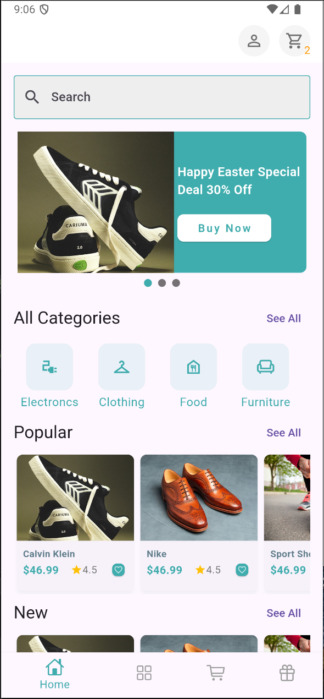
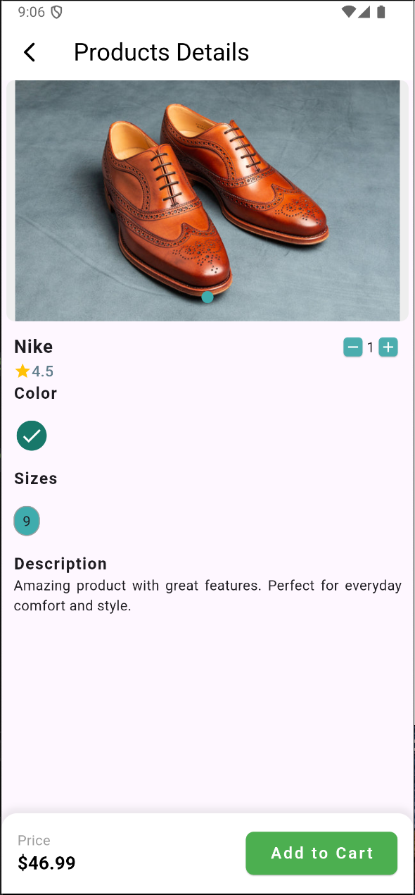
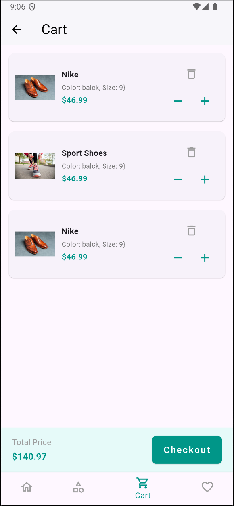

# shop_app

A new Flutter project.

## Getting Started

This project is a starting point for a Flutter application.

### How to Run the Project

1. Clone the repository:
   ```bash
   git clone <repository_url>
   ```
2. Navigate to the project directory:
   ```bash
   cd shop_app
   ```
3. Install the dependencies:
   ```bash
   flutter pub get
   ```
4. Run the application:
   ```bash
   flutter run
   ```

### About the Project

This is a Flutter-based e-commerce mobile application that works seamlessly on both Android and iOS platforms. It was implemented as an exercise project within a single day.

### Screenshots

Below are some screenshots of the application:




